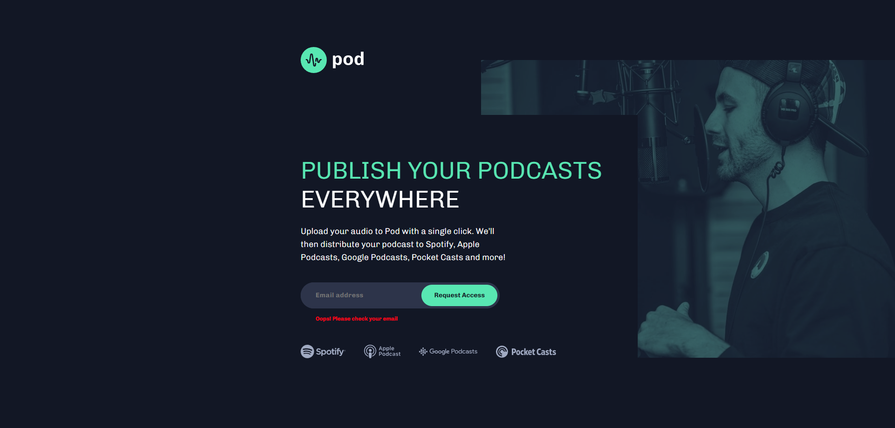

# Frontend Mentor - Pod request access landing page solution

This is a solution to the [Pod request access landing page challenge on Frontend Mentor](https://www.frontendmentor.io/challenges/pod-request-access-landing-page-eyTmdkLSG). Frontend Mentor challenges help you improve your coding skills by building realistic projects. 

## Table of contents

- [Overview](#overview)
  - [The challenge](#the-challenge)
  - [Screenshot](#screenshot)
  - [Links](#links)
- [My process](#my-process)
  - [Built with](#built-with)
  - [Continued development](#continued-development)
- [Author](#author)

## Overview

### The challenge

Users should be able to:

- View the optimal layout depending on their device's screen size
- See hover states for interactive elements
- Receive an error message when the form is submitted if:
  - The `Email address` field is empty should show "Oops! Please add your email"
  - The email is not formatted correctly should show "Oops! Please check your email"

### Screenshot

### Links

- Solution URL: 
- Live Site URL: 

## My process
En un principio use la metodología de (first mobile) pero me percate que depende de la manera en que este construido un diseño se elige una o la otra, así que decidi empezar por el sitio de escritorio. 
Esto genero que mi forma de construir el sitio web tubiera mejores practicas, y que a su vez fuera más sencillo el matenimeinto del codigo.

### Built with

- HTML5 semantico
- CSS custom properties
- Flexbox
- CSS media queries sintaxis de rango
- JavaScript - Manejo del DOM con un poco de typescript

### Continued development

Seguire enfocandome en Asstro.build me parece un framework muy potente y realmente tiene muchas funcionalidades es realmente el framework para frontend en todos los sentidos, apreder typescript es fundamental, y quiero empezar con algo de manejo de apis. 

## Author

- Github- [Ander Correa](https://github.com/ascorrea)
- Frontend Mentor - [@chokdiand](https://www.frontendmentor.io/profile/chokdiand)
